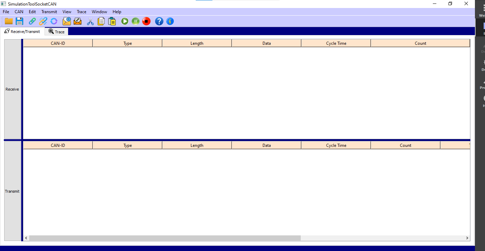

# Simulation-Tool-For-PCAN
The PCAN Simulation Tool is a software application designed to simulate Controller Area Network (CAN) communication for PCAN devices. 
CAN is a robust and widely used serial communication protocol in automotive and industrial applications, 
enabling real-time data exchange between electronic control units (ECUs) in a networked environment.

# Running the Qt Project:
To Run this project, follow these steps:

### Prerequisites:

1.Install Qt framework on your system if you haven't already. You can download it from <https://www.qt.io/download-dev>.

2.Clone the Repository : git clone <https://github.com/Gurunatha14/Simulation-Tool-For-PCAN>

### Build the Project

1.Open the project in Qt Creator.

2.Configure the project settings as needed.

3.Build the project by clicking the build button or using the keyboard shortcut (e.g., Ctrl + B).

4.Run the Application:

5.After successfully building the project, run the application from within Qt Creator or locate the executable file in the build directory and run it.
Explore the Application:

6.Once the application is running, explore its features and functionalities for simulating PCAN communication.

### Conclusion:
The PCAN Simulation Tool is a versatile and indispensable resource for developers, engineers, and researchers working with CAN-based systems. 
With its comprehensive features, intuitive interface, and seamless integration with PCAN hardware, the tool empowers users 
to streamline development, enhance reliability, and accelerate innovation in their projects.

## Front-Page

# NOTE
Not all the fetures are added ,But it Ensures SENDING and READING Messages. 
